# Laravel E-Commerce


A full-stack e-commerce application built with Laravel, Inertia, and Vue. Features product management, shopping cart, checkout flow, order tracking, product reviews & ratings, real-time notifications, and an admin dashboard.

## Live Demo

[demo-project-production-8ced.up.railway.app](https://demo-project-production-8ced.up.railway.app)

---

## Screenshots

| Homepage | Shop | Cart |
|----------|------|------|
| 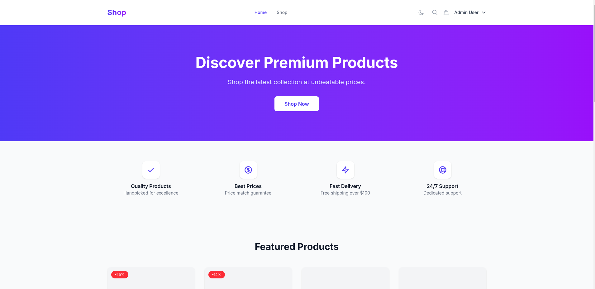 | 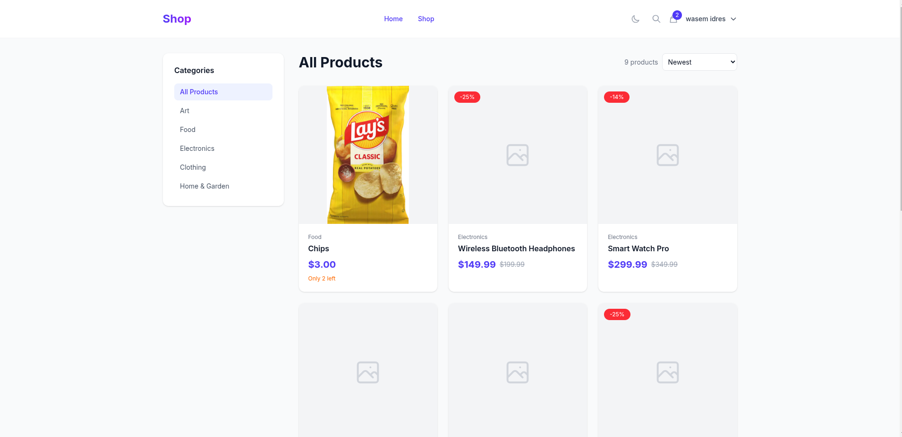 | 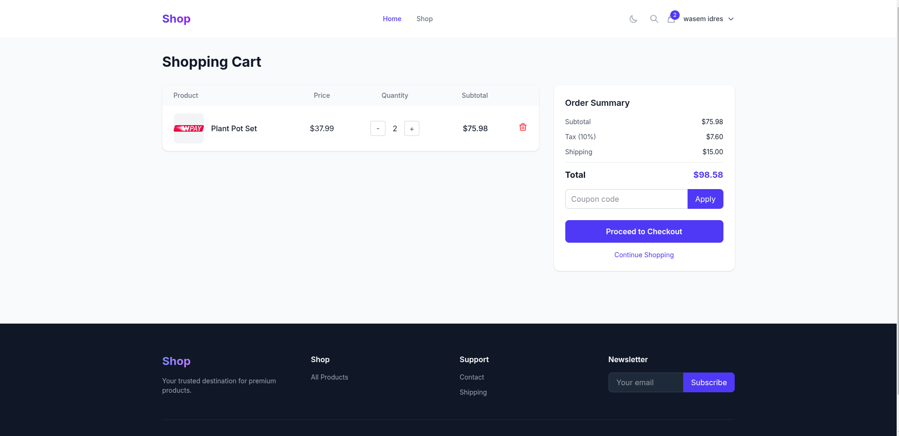 |

| Checkout | Dashboard | Products |
|----------|-----------|----------|
| 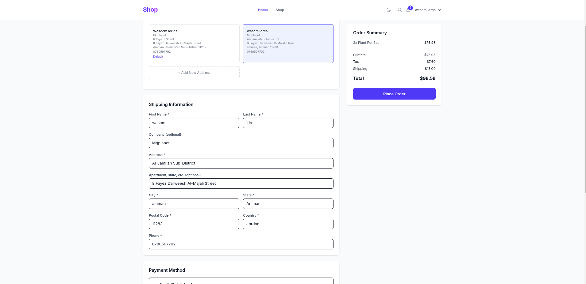 | 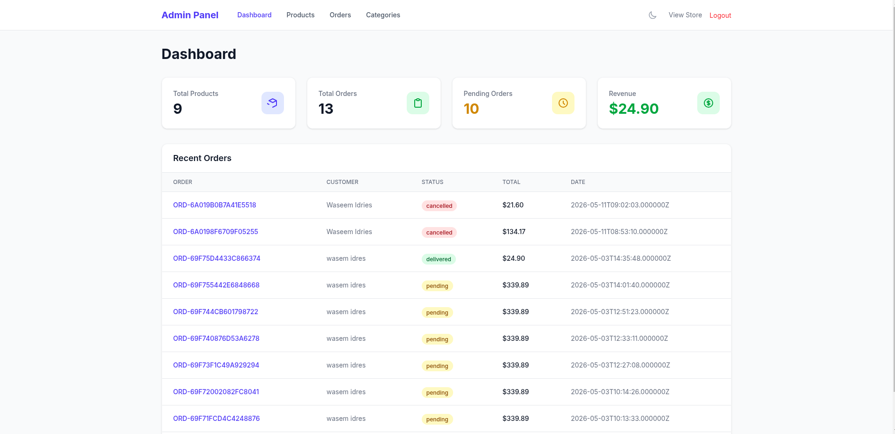 | 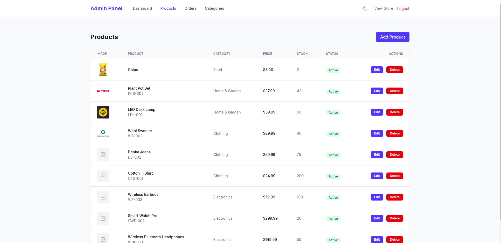 |

| Login | Register | Addresses |
|-------|----------|-----------|
| 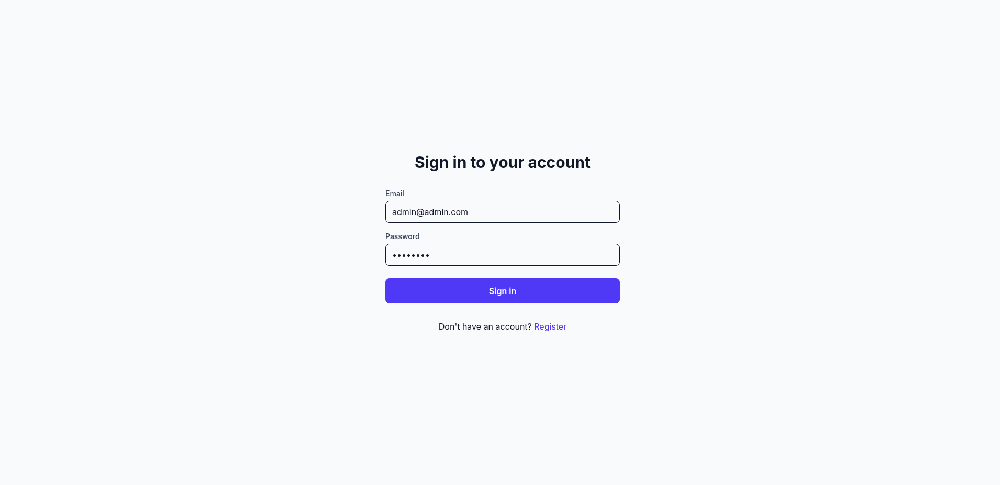 | 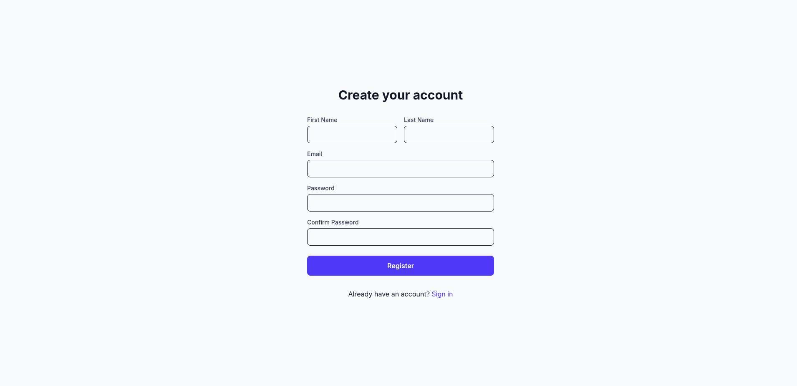 | 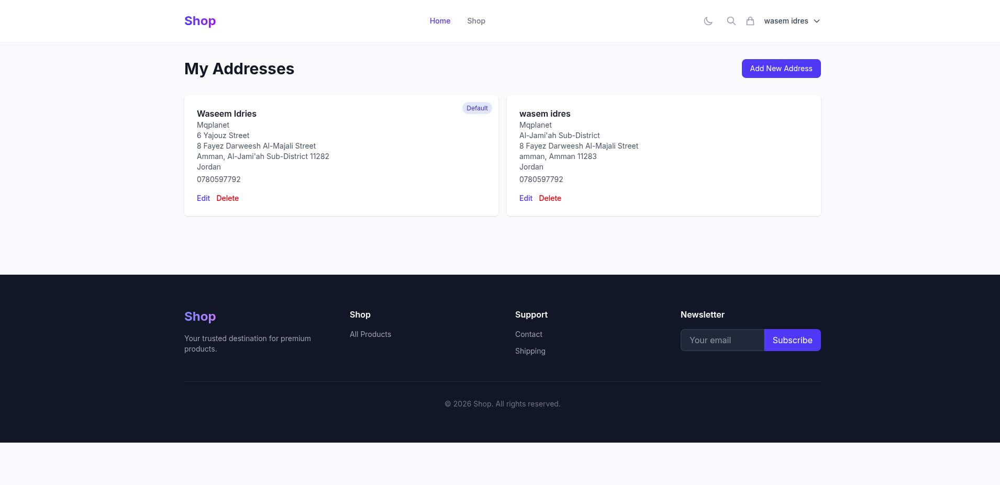 |

| Orders (User) | Order Detail |
|---------------|--------------|
| 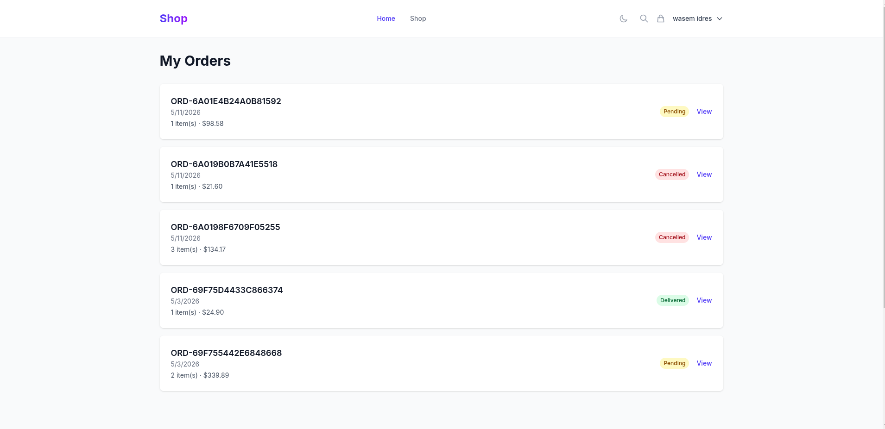 | 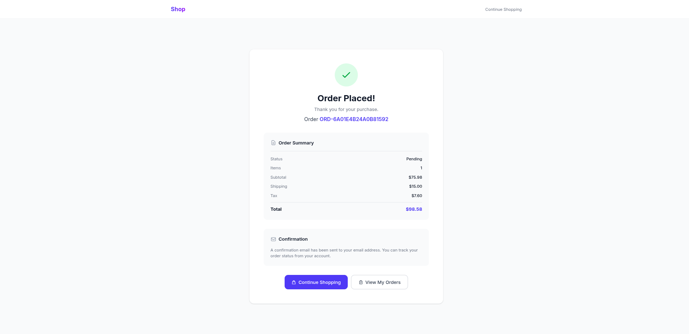 |


---

## Tech Stack

| Layer | Technology |
|-------|-----------|
| Backend | Laravel 13 |
| Frontend | Vue 3 (Composition API) |
| Bridge | Inertia.js |
| Database | MySQL |
| Server | FrankenPHP (Caddy) |
| Containerization | Docker |
| Hosting | Railway |
| Build | Vite |

---

## Features

- **Product Reviews & Ratings** — customers leave reviews with star ratings; admin approval workflow; edit/delete own reviews; average rating displayed on product cards, detail page, and wishlist; admin notification on new review
- **Authentication** — user registration, login, logout, password reset, email verification
- **Password Reset** — forgot/reset password flow with email notification
- **Email Verification** — verify email addresses after registration; unverified users see a notice page with resend option
- **Wishlist** — save/favorite products for later; heart toggle on product cards, detail page, and dedicated wishlist page
- **Product Management** — create, edit, delete products with image uploads (main image + gallery, max 5)
- **Category Management** — organize products by category
- **Shopping Cart** — add/remove items, apply coupons, real-time totals
- **Checkout** — saved addresses, shipping info, payment method selection
- **Order Management** — place orders, view order history, admin status updates
- **Stock Tracking** — automatic stock decrement on order, restore on cancellation
- **Role-Based Access Control** — Spatie Laravel Permission with granular permissions per module (create, read, update, delete)
- **Admin Dashboard** — manage products, orders, users, categories, roles
- **User Management** — list, create, edit users with single role assignment; filter by client/non-client
- **Role & Permission Management** — create/edit roles with grouped permission matrix UI; system roles (admin/client) are locked
- **Image Gallery** — separate main product image and gallery uploads, 3MB limit per image
- **Responsive Design** — mobile-friendly layout via Tailwind CSS

> **Default admin account:** `admin@admin.com` / `password` (has full permissions)
> **Registration assigns** the `client` role (no admin permissions by default)

---

---

## Real-Time Notifications

Notifications use Laravel Reverb (WebSocket) + Echo for push delivery, with two separate scopes:

| Scope | Broadcast Event | Channel | DB Table | Visible In |
|-------|----------------|---------|----------|------------|
| **Client** | `ClientNotificationBroadcast` | `App.Models.User.{id}` | `notifications` (Laravel's) | Shop/orders area |
| **Admin** | `AdminNotificationBroadcast` | `admin.notifications` (requires `admin.access`) | `admin_notifications` + pivot `admin_notification_user` | Admin panel |

- Both events use `ShouldBroadcastNow` (synchronous, no queue worker needed)
- `AdminNotification::notify()` creates a single row + broadcasts — all admins see it
- Pivot row in `admin_notification_user` is created **only when an admin reads** (unread = no row)
- Client notifications persist via `$user->notify()` (Laravel's `notifications` table)

### Broadcasting Config

```env
BROADCAST_CONNECTION=reverb
QUEUE_CONNECTION=sync
VITE_REVERB_HOST=127.0.0.1
VITE_REVERB_PORT=8081
VITE_REVERB_SCHEME=http
```

### Start Reverb

```bash
php artisan reverb:start --host=127.0.0.1 --port=8081
```

### Testing (ephemeral — no DB save, gone on refresh)

```bash
# Test client notification (appears in shop bell)
php artisan notify:test 2

# Test admin notification (appears in admin bell)
php artisan notify:test 2 --admin
```

Replace `2` with the target user's ID.

---

## Architecture

This project uses the **Laravel + Inertia + Vue** stack:

```
Browser → Laravel Route → Controller → Inertia → Vue Page
```

- **Laravel** handles routing, database, authentication, validation, and business logic
- **Inertia** acts as the bridge — first page load is a full HTML render; subsequent navigations send an `X-Inertia` header and Laravel returns only JSON (component name + props)
- **Vue** receives the component name and props, then renders the UI dynamically without full page reloads

For mutations (form submissions), Laravel returns a redirect. Inertia's client follows the redirect with a GET request, fetching fresh props from the server — keeping the server as the single source of truth.

See [`inertia.md`](inertia.md) for a detailed explanation of the data flow.

---

## Installation

### Prerequisites

- PHP 8.3+
- Composer
- Node.js 22+
- MySQL 8.0+

### Setup

```bash
# Clone the repository
git clone https://github.com/wasem1a1w-sketch/demo-project.git
cd demo-project

# Install PHP dependencies
composer install

# Install JavaScript dependencies
npm install

# Environment setup
cp .env.example .env
php artisan key:generate

# Create a MySQL database named 'myproject' (or update DB_DATABASE in .env)

# Run migrations and seeders
php artisan migrate --seed

# Build frontend assets
npm run build

# Start the development server
php artisan serve
```

The app will be available at `http://localhost:8000`. Default admin credentials:

- **Email:** `admin@admin.com`
- **Password:** `password`

---

## Testing

### Backend (PHPUnit)

```bash
# Run all feature tests
php vendor/bin/phpunit tests/Feature/

# Run only review tests
php vendor/bin/phpunit tests/Feature/Api/ProductReviewTest.php tests/Feature/Admin/ReviewTest.php
```

### Frontend (Vitest)

```bash
# Run all frontend tests
npx vitest run tests/frontend/

# Watch mode
npx vitest tests/frontend/
```

> Tests run automatically on every push via [GitHub Actions](.github/workflows/ci.yml) (PHP 8.4 + Node 22, SQLite in-memory).

---

## Docker Deployment

A `Dockerfile` and `Caddyfile` are included for containerized deployment:

```bash
# Build the image
docker build -t laravel-ecommerce .

# Run the container
docker run -p 8080:8080 laravel-ecommerce
```

The Docker setup uses **FrankenPHP** — a modern PHP application server built on Caddy. It handles PHP execution, static file serving, and TLS automatically. The `Caddyfile` configures the server to listen on port 8080 (configurable via `$PORT` environment variable for Railway).

### Environment Variables

| Variable | Description | Default |
|----------|-------------|---------|
| `APP_ENV` | Application environment | `production` |
| `APP_KEY` | Laravel app key | auto-generated |
| `APP_URL` | Application URL | — |
| `DB_CONNECTION` | Database driver | `mysql` |
| `DB_DATABASE` | Database name | `myproject` |

---

## Author

**Waseem Idries**
- GitHub: [@wasem1a1w-sketch](https://github.com/wasem1a1w-sketch/demo-project)
