# Laravel E-Commerce


A full-stack e-commerce application built with Laravel, Inertia, and Vue. Features product management, shopping cart, checkout flow, order tracking, product reviews & ratings, real-time notifications, and an admin dashboard.

## Live Demo

[demo-project-production-8ced.up.railway.app](https://demo-project-production-8ced.up.railway.app)

---

## Screenshots

| Homepage | Shop | Cart |
|----------|------|------|
| 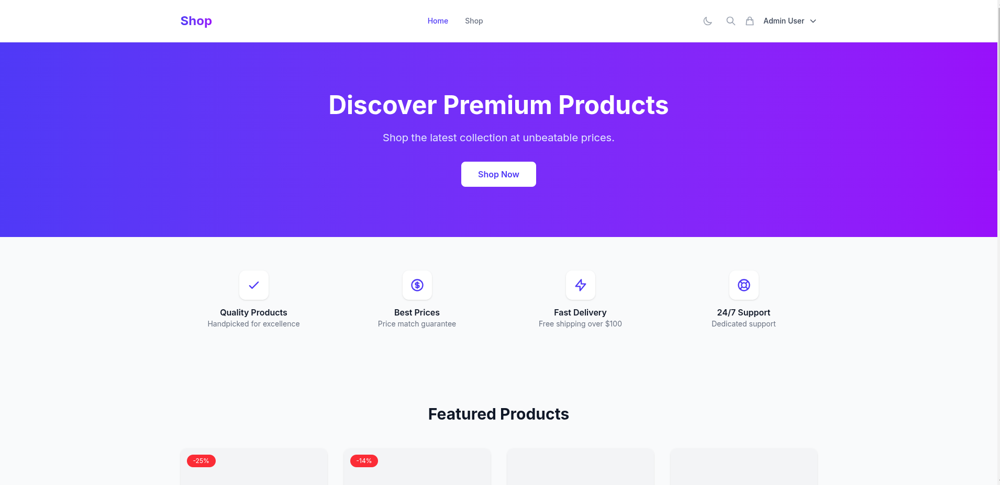 | 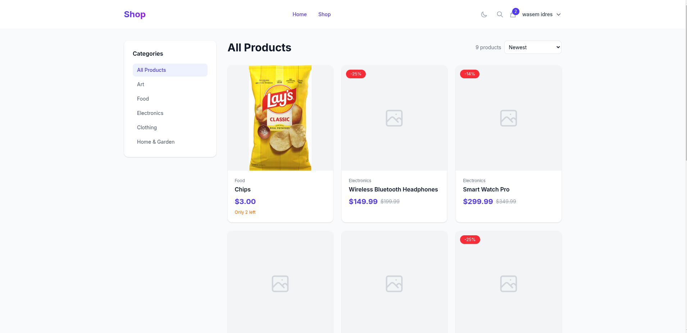 | 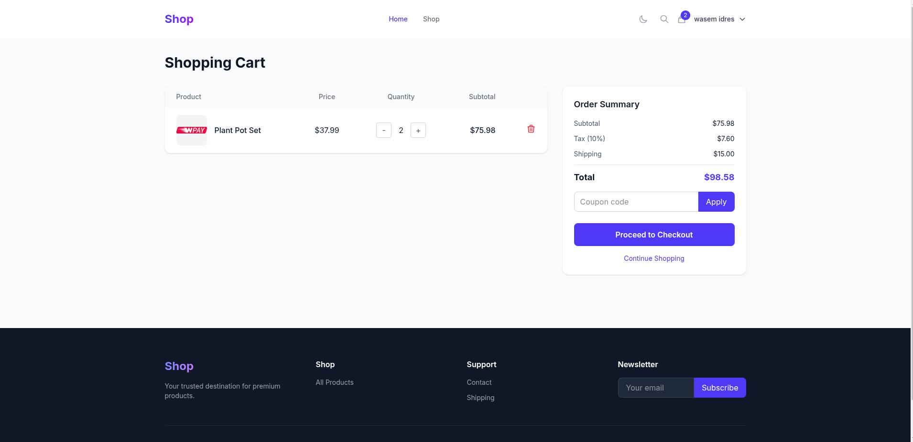 |

| Checkout | Dashboard | Products |
|----------|-----------|----------|
| 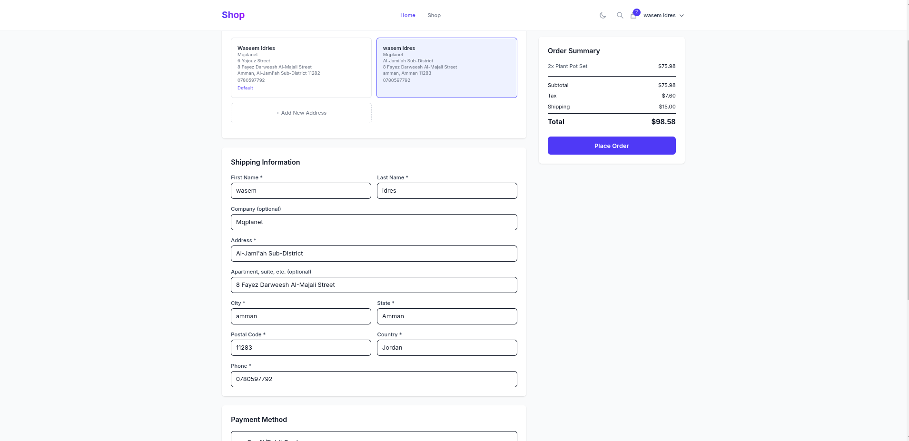 | 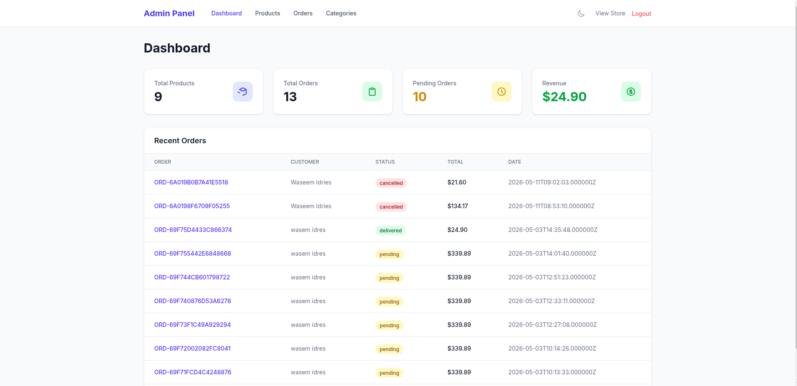 | 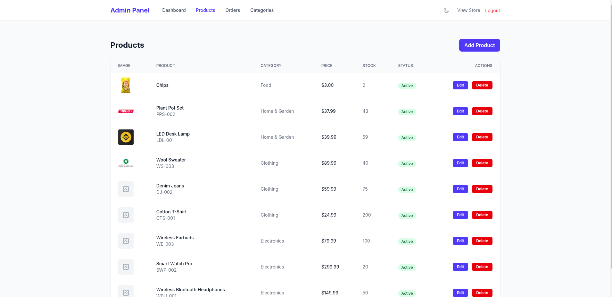 |

| Login | Register | Addresses |
|-------|----------|-----------|
| 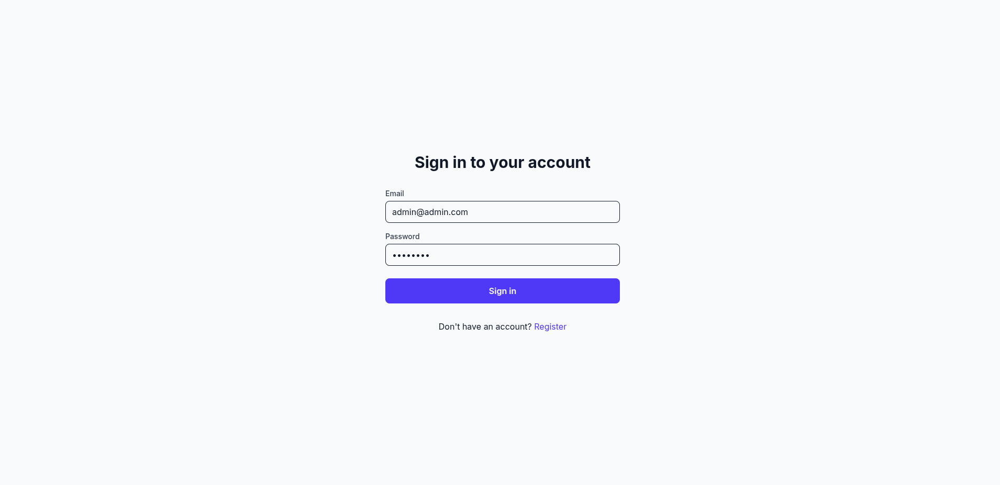 | 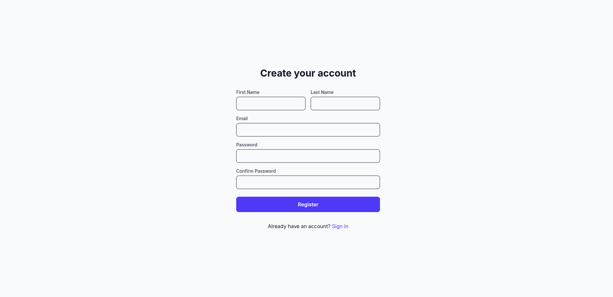 | 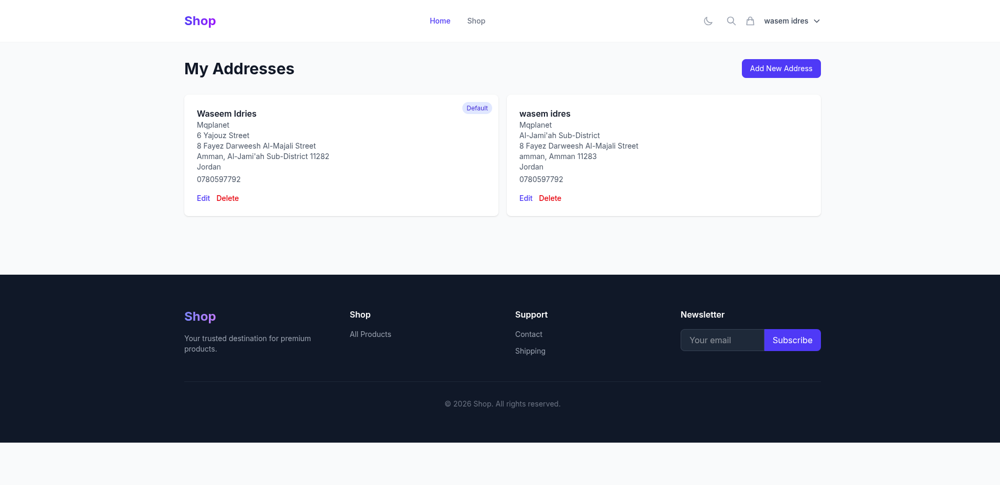 |

| Orders (User) | Order Detail |
|---------------|--------------|
| 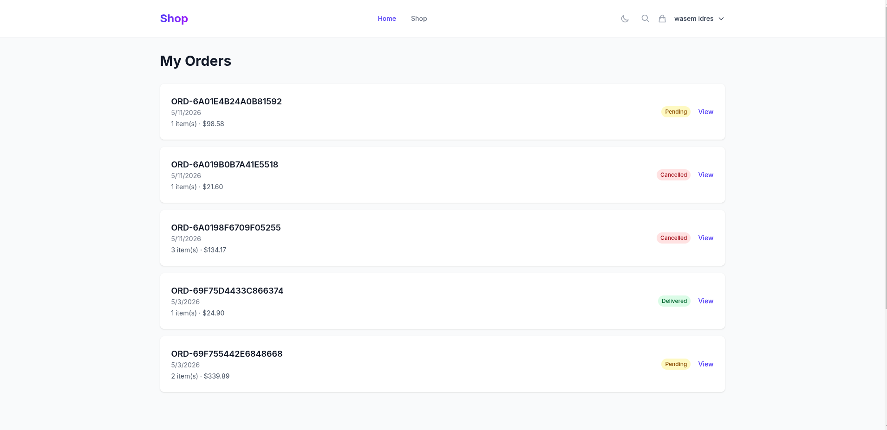 | 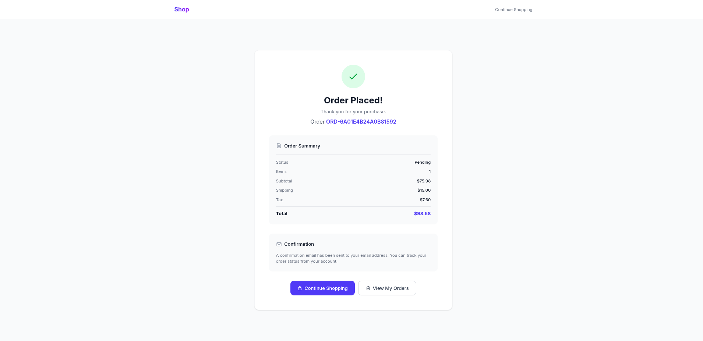 |


---

## Tech Stack

| Layer | Technology |
|-------|-----------|
| Backend | Laravel 13 |
| Frontend | Vue 3 (Composition API) |
| Bridge | Inertia.js v3 |
| State Management | Pinia |
| Database | MySQL 8.0 |
| WebSockets | Laravel Reverb |
| Server | FrankenPHP (Caddy) |
| Containerization | Docker |
| Hosting | Railway |
| Build | Vite |
| CSS | Tailwind CSS v4 |
| Charts | ApexCharts |
| RBAC | Spatie Laravel Permission |
| Image Processing | Imagick (WebP) |
| Monitoring | Laravel Pulse |

---

## Features

### Storefront (Public)

- **Homepage** — featured products grid, top-level categories with product counts
- **Shop / Product Listing** — paginated grid (12/page), filter by category/search/featured, sort by newest/price/name, average rating per product
- **Product Autocomplete** — AJAX search-as-you-type (up to 7 results: name, slug, price, category, icon)
- **Product Detail** — full product info, images, average rating, review count
- **Category Listing** — hierarchical categories (parent/children), ordered by sort, active-only
- **Shopping Cart** — session-based (guest-friendly), add/update/remove/clear, stock validation, coupon application, real-time pricing (subtotal, discount, tax, shipping, total), free shipping threshold
- **Checkout** — shipping address form, payment method selection (Stripe, PayPal, Offline), server-side recalculated totals
- **Checkout Success** — order confirmation page after successful placement
- **Newsletter Subscription** — subscribe/unsubscribe email via AJAX
- **Contact Page** — contact form (name, email, message) stored in database

### Customer Account (Authenticated)

- **Order History** — paginated list of own orders with items
- **Order Detail** — view single order by order number, includes items, product images, payment history
- **Address Book** — CRUD shipping/billing addresses, default address toggle (one per type per user)
- **Wishlist** — add/remove products, toggle from product page, clear all, database-backed persistence
- **Product Reviews** — create review with rating (1-5), optional title/body; one review per product per user; edit/delete own; admin approval required
- **Payment Processing** — Stripe Checkout Sessions, PayPal Orders API (create + capture), payment retry (max 3 attempts), status tracking (pending/paid/failed/refunded/expired)
- **Notification Center** — paginated notification list, unread count, mark read/all read, real-time WebSocket via Laravel Echo + Reverb

### Admin Panel

- **Dashboard** — stats (products, orders, revenue), 7-day charts (ApexCharts), recent orders table, permission-gated visibility
- **Product Management** — CRUD with image upload; auto WebP conversion via Imagick, 3 generated sizes (1920px, 400x400, 100x100); stock/sku/weight/category/featured toggles
- **Order Management** — list/filter by status, view detail, update status (pending→processing→shipped→delivered→cancelled), update payment status; cancellation auto-restocks items + notifies user
- **Category Management** — CRUD with parent hierarchy, active/sort order controls, product count
- **Coupon Management** — CRUD with type (percentage/fixed), value, min/max amounts, usage limits, date ranges, unique code validation
- **User Management** — CRUD with role assignment, role filtering, pagination
- **Role & Permission Management** — create/edit roles with grouped permission matrix (30+ permissions), system roles (admin/client) locked
- **Review Moderation** — list all reviews, approve/reject/delete with real-time user notification
- **Settings Management** — manage shipping rate, free shipping threshold, tax rate, Stripe/PayPal credentials
- **Activity Log Viewer** — filterable audit trail (25+ event types, date range, paginated 50/page)
- **Monitoring (Laravel Pulse)** — real-time dashboards at `/pulse` (servers, requests, slow queries, exceptions, queues, cache) with user-selectable period filter (1h / 6h / 24h / 7d)
- **Exception Viewer** — every reported exception is auto-captured with its full stack trace, request context, affected user, and environment; filterable admin page with expandable traces and copy-to-clipboard
- **Admin Notification Center** — separate system from user notifications, real-time via Reverb on private admin channel

### Platform-wide

- **Authentication** — registration, login, logout, email verification (MustVerifyEmail), password reset
- **Rate Limiting** — per-endpoint: API (60/min), login (5/min), register (3/min), password reset (3/min), checkout (10/min)
- **Role-Based Access Control** — Spatie Laravel Permission with 30+ granular permissions per module
- **Stock Tracking** — auto decrement on order placement, restore on cancellation/failure
- **Activity Logging** — 25+ event types across all features (user_id, type, description, IP, user agent)
- **Exception Capture** — `reportable()` hook stores all exceptions (class, message, stack trace, file:line, method/URL/IP, user, environment) in an `exceptions` table; pruned weekly via `exceptions:prune`
- **Image Processing** — Imagick WebP conversion, 3 sizes (original 1920px max, thumbnail 400x400, icon 100x100), 3MB limit
- **Responsive Design** — mobile-friendly via Tailwind CSS
- **Theme Support** — dark/light mode toggle, system preference detection, localStorage persistence

### Payment Gateways

| Provider | Method | Mock Mode | Features |
|----------|--------|-----------|----------|
| **Stripe** | Checkout Sessions (card) | Yes (fake session ID/URL) | Webhook handling (`checkout.session.completed`, `payment_intent.payment_failed`), session retrieval |
| **PayPal** | Orders API v2 (capture intent) | Yes (fake COMPLETED capture) | OAuth2 token, order create/capture, return/cancel URL handling |
| **Offline** | Manual confirmation | N/A | No processing — admin confirms payment manually |

All payment credentials configurable via admin Settings page (stored in DB) or `.env` / `config/services.php`.

### Frontend Architecture

| Layer | Technology |
|-------|-----------|
| SPA Engine | Vue 3 (Composition API) + Inertia.js v3 |
| State Management | Pinia (5 stores: cart, wishlist, notifications, theme, reviews) |
| WebSocket Client | Laravel Echo + Pusher JS |
| Charts | ApexCharts (vue3-apexcharts) |
| CSS | Tailwind CSS v4 (class-based dark mode) |
| HTTP | Axios (CSRF token bound globally) |
| Routes (JS) | Ziggy — Laravel route names available as `route()` in Vue |

**Reusable Components:** LazyImage, Dropdown, Pagination, ConfirmModal, StarRating, ProductReviews, NotificationBell, Notifications, ThemeToggle, Link

**Composables:** `usePermission` (permission check from Inertia shared props), `useNotification` (ephemeral toast notifications with auto-dismiss)

### Security

- CSRF protection (token in meta tag, Axios default)
- Role/permission gates on every admin route (`AdminOnly` middleware + Spatie gates)
- Rate limiting on auth/checkout endpoints
- Email verification enforced for sensitive operations
- Session-based authentication with Sanctum
- Trusted proxy config for production (AWS ELB compatible)
- Protected system roles (admin/client) cannot be edited/deleted

> **Default admin account:** `admin@admin.com` / `password` (has full permissions)
> **Registration assigns** the `client` role (no admin permissions by default)

---

---

## Real-Time Notifications

Notifications use Laravel Reverb (WebSocket) + Echo for push delivery, with two separate scopes:

| Scope | Broadcast Event | Channel | DB Table | Visible In |
|-------|----------------|---------|----------|------------|
| **Client** | `ClientNotificationBroadcast` | `App.Models.User.{id}` | `notifications` (Laravel's) | Shop/orders area |
| **Admin** | `AdminNotificationBroadcast` | `admin.notifications` (requires `admin.access`) | `admin_notifications` + pivot `admin_notification_user` | Admin panel |

- Both events use `ShouldBroadcastNow` (synchronous, no queue worker needed)
- `AdminNotification::notify()` creates a single row + broadcasts — all admins see it
- Pivot row in `admin_notification_user` is created **only when an admin reads** (unread = no row)
- Client notifications persist via `$user->notify()` (Laravel's `notifications` table)

### Broadcasting Config

```env
BROADCAST_CONNECTION=reverb
QUEUE_CONNECTION=sync
VITE_REVERB_HOST=127.0.0.1
VITE_REVERB_PORT=8081
VITE_REVERB_SCHEME=http
```

### Start Reverb

```bash
php artisan reverb:start --host=127.0.0.1 --port=8081
```

### Testing (ephemeral — no DB save, gone on refresh)

```bash
# Test client notification (appears in shop bell)
php artisan notify:test 2

# Test admin notification (appears in admin bell)
php artisan notify:test 2 --admin
```

Replace `2` with the target user's ID.

---

## Monitoring & Observability

The project uses **Laravel Pulse** for real-time application monitoring, plus a custom exception tracker with an admin viewer.

### Laravel Pulse

- **Dashboard** — `/pulse` (requires `admin.access`), showing servers (CPU/memory/storage), application usage, queues, cache, slow queries, exceptions, slow requests/jobs/outgoing requests
- **Storage** — database driver (`pulse_entries` / `pulse_aggregates` tables, installed by `php artisan migrate`)
- **Data collection** — `pulse:check` runs every minute via the scheduler in `routes/console.php`; Docker starts `php artisan schedule:work` automatically
- **Period filter** — user-selectable **1h / 6h / 24h / 7d** via the header tabs (native Pulse default is 1h)

```bash
php artisan pulse:check        # run aggregation manually
php artisan pulse:clear --force # wipe all captured Pulse data
```

### Slow-Query Demo

The admin dashboard normally runs fast, indexed queries. To generate **real** slow queries for Pulse, set:

```env
SLOW_DEMO=true
```

When enabled, the dashboard runs three realistically poorly-written queries against `user_activity_logs` (e.g. `ORDER BY RAND()`, `GROUP BY SUBSTRING(...)`, `REGEXP ... LIKE '%bot%'`), so Pulse records genuine `slow_query` entries with file:line locations. Seed ~500k rows to make them slow:

```bash
php artisan db:seed --class=SlowDemoSeeder --force   # 500k rows (configurable via SLOW_DEMO_ROWS)
```

Seeded rows are tagged `data.demo=true` and can be removed afterwards:

```sql
DELETE FROM user_activity_logs WHERE JSON_EXTRACT(data, "$.demo") = true;
```

### Exception Tracking

Every reported exception (HTTP requests, queue jobs, console commands) is captured into an `exceptions` table via a `reportable()` hook (`app/Services/ExceptionTracker.php`):

- Full stack trace (50 frames), file:line, full message
- Request context: method, URL, IP
- Authenticated user and environment
- Capture is crash-safe (re-entrancy guard + silent failure) — it can never break the app

**Admin Exceptions page** — `/admin/exceptions` (requires `exceptions.read` permission): search, class filter, date range, paginated table, and a detail modal with the full message, request context, user, and stack trace (copy-to-clipboard). A **"Throw test exception"** button records a demo exception on demand.

**Pruning** — `exceptions:prune {--days=30}` deletes records older than N days (default 30) and is scheduled weekly.

```bash
php artisan exceptions:prune --days=30
```

---

## Kafka Event Streaming

Async event streaming via Apache Kafka (`mateusjunges/laravel-kafka`). Producers publish to topics; long-running consumer workers (`kafka:consume`) process them asynchronously. Each event is an `App\Kafka\EventEnvelope`:

> See **[`KAFKA.md`](KAFKA.md)** for a detailed walkthrough of the Kafka code — the
> transactional outbox, every producer/consumer, delivery guarantees, failure scenarios,
> and the operations runbook.

```json
{
  "event_type": "payment.confirmed",
  "event_id": "<uuid>",
  "occurred_at": "2026-08-10T10:00:00+00:00",
  "key": "<partition-key>",
  "data": { "...": "..." }
}
```

`event_id` (UUID) enables idempotent processing; `key` controls partitioning (per-user, per-order, per-session).

### Transactional Outbox

Producers never publish to Kafka directly. Instead they write an event envelope to the **`outbox_messages`** table (`App\Kafka\Outbox::record()`) **inside the same DB transaction** as the business change, and a dispatcher ships pending rows to Kafka:

- If the DB transaction rolls back, the outbox row rolls back too — no ghost events.
- If the DB commits but Kafka is down, the row stays `pending` in MySQL and is delivered on a later run — no lost events, full paper trail.
- `outbox:dispatch` is scheduled **every minute** (`routes/console.php`, `withoutOverlapping`); it claims each row (compare-and-set, so concurrent workers never double-send), publishes via `KafkaEventPublisher`, and marks it `sent`.
- A failed send increments `attempts` and backs off exponentially (`available_at = now + 2^(attempts-1) min`, capped at 30 min). After 5 attempts the row is left permanently `failed` for manual review.

```bash
php artisan outbox:dispatch                 # deliver pending rows now
php artisan outbox:dispatch --limit=1000    # cap the batch size
```

### Topics (`app/Kafka/KafkaTopics.php`)

| Topic | Produced by | Consumed by |
|---|---|---|
| `user-activity-logs` | `UserActivityLog::record()` | `ActivityLogHandler` → `UserActivityLog::persist()` |
| `order-events` | `OrderService::placeOrder()`, `Order::transitionStatus()` | `OrderNotificationsHandler` (emails + broadcasts), `OrderAnalyticsHandler` (activity rows) |
| `payment-events` | `PaymentController@handleWebhook` | `PaymentEventProcessor` |
| `payment-events-retry` | `PaymentEventProcessor` (transient failures) | `PaymentEventProcessor` |
| `payment-events-dlq` | `PaymentEventProcessor` (dead letter queue) | none (manual inspection) |

The first three rows are recorded via the transactional outbox. The `-retry`/`-dlq` topics are published directly by `PaymentEventProcessor` (already async at-least-once via offset commits); delivery is handled by `App\Kafka\KafkaEventPublisher`.

### Consumers

Run one worker per topic group (production: via Supervisor / process manager). Workers commit offsets manually (at-least-once):

```bash
php artisan kafka:consume activity-logs
php artisan kafka:consume order-notifications
php artisan kafka:consume order-analytics
php artisan kafka:consume payments        # payment-events + payment-events-retry
```

### Payment idempotency & retry

`PaymentEventProcessor` records `event_id` in the `processed_payment_events` table before processing (idempotency), and releases the claim on failure. Transient failures are re-published to `payment-events-retry` with an incremented `attempts` counter; after 3 attempts the event goes to `payment-events-dlq` for manual review.

### Local setup

```bash
# 1. Start Kafka + Kafka UI (Kafka UI at http://localhost:8082)
sudo docker compose up -d kafka kafka-ui

# 2. Publish a test event / list topics
php artisan kafka:produce --topic=user-activity-logs
```

Environment variables:

| Variable | Description | Default |
|---|---|---|
| `KAFKA_BROKERS` | Comma-separated broker addresses | `localhost:9092` |
| `KAFKA_CONSUMER_GROUP_ID` | Default consumer group | `app-default` |
| `KAFKA_OFFSET_RESET` | Offset policy for new groups | `earliest` |
| `KAFKA_AUTO_COMMIT` | Auto-commit offsets | `false` |

> Note: the Kafka producer/consumer path requires the `rdkafka` PHP extension. In this repo it is built into `~/.local`; use the `bin/php` wrapper so `php artisan`, `php composer`, and `php vendor/bin/phpunit` resolve it.

### Testing

Feature tests never touch a real broker. Producers record into the outbox table, so tests call `dispatchOutbox()` to deliver pending rows to the faked broker (`Kafka::fake()`), then the `Tests\Support\InteractsWithKafka` trait routes captured messages through their **real** consumer handlers (`drainActivityLogs`, `drainOrderEvents`, `drainPaymentEvents`), exercising the full pipeline end-to-end. See `tests/Feature/Kafka/`.

---

## Architecture

This project uses the **Laravel + Inertia + Vue** stack:

```
Browser → Laravel Route → Controller → Inertia → Vue Page
```

- **Laravel** handles routing, database, authentication, validation, and business logic
- **Inertia** acts as the bridge — first page load is a full HTML render; subsequent navigations send an `X-Inertia` header and Laravel returns only JSON (component name + props)
- **Vue** receives the component name and props, then renders the UI dynamically without full page reloads

For mutations (form submissions), Laravel returns a redirect. Inertia's client follows the redirect with a GET request, fetching fresh props from the server — keeping the server as the single source of truth.

See [`inertia.md`](inertia.md) for a detailed explanation of the data flow.

---

## Installation

### Prerequisites

- PHP 8.3+
- Composer
- Node.js 22+
- MySQL 8.0+

### Setup

```bash
# Clone the repository
git clone https://github.com/wasem1a1w-sketch/demo-project.git
cd demo-project

# Install PHP dependencies
composer install

# Install JavaScript dependencies
npm install

# Environment setup
cp .env.example .env
php artisan key:generate

# Create a MySQL database named 'myproject' (or update DB_DATABASE in .env)

# Run migrations and seeders
php artisan migrate --seed

# Build frontend assets
npm run build

# Start the development server
php artisan serve
```

The app will be available at `http://localhost:8000`. Default admin credentials:

- **Email:** `admin@admin.com`
- **Password:** `password`

---

## Testing

### Backend (PHPUnit)

```bash
# Run all feature tests
php vendor/bin/phpunit tests/Feature/

# Run only review tests
php vendor/bin/phpunit tests/Feature/Api/ProductReviewTest.php tests/Feature/Admin/ReviewTest.php
```

### Frontend (Vitest)

```bash
# Run all frontend tests
npx vitest run tests/frontend/

# Watch mode
npx vitest tests/frontend/
```

> Tests run automatically on every push via [GitHub Actions](.github/workflows/ci.yml) (PHP 8.4 + Node 22, SQLite in-memory).

---

## Docker Deployment

A `Dockerfile` and `Caddyfile` are included for containerized deployment:

```bash
# Build the image
docker build -t laravel-ecommerce .

# Run the container
docker run -p 8080:8080 laravel-ecommerce
```

The Docker setup uses **FrankenPHP** — a modern PHP application server built on Caddy. It handles PHP execution, static file serving, and TLS automatically. The `Caddyfile` configures the server to listen on port 8080 (configurable via `$PORT` environment variable for Railway).

### Environment Variables

| Variable | Description | Default |
|----------|-------------|---------|
| `APP_ENV` | Application environment | `production` |
| `APP_KEY` | Laravel app key | auto-generated |
| `APP_URL` | Application URL | — |
| `DB_CONNECTION` | Database driver | `mysql` |
| `DB_DATABASE` | Database name | `myproject` |
| `BROADCAST_CONNECTION` | Broadcast driver | `reverb` |
| `QUEUE_CONNECTION` | Queue driver | `sync` |
| `REVERB_APP_ID` | Reverb app ID | — |
| `REVERB_APP_KEY` | Reverb app key | — |
| `REVERB_APP_SECRET` | Reverb app secret | — |
| `STRIPE_KEY` | Stripe publishable key | — |
| `STRIPE_SECRET` | Stripe secret key | — |
| `PAYPAL_CLIENT_ID` | PayPal client ID | — |
| `PAYPAL_SECRET` | PayPal secret | — |
| `SLOW_DEMO` | Run demo slow queries on the admin dashboard for Pulse | `false` |
| `SLOW_DEMO_ROWS` | Target row count for `SlowDemoSeeder` | `500000` |
| `PULSE_ENABLED` | Master switch for all Pulse recorders | `true` |
| `PULSE_PATH` | Pulse dashboard path | `pulse` |

---

## Refactoring (May 2026)

All controller validation extracted to **21 FormRequest classes** in `app/Http/Requests/`. Store/update requests combined with `unique:table,column,ignore` via route parameter.

### N+1 Query Fixes

| File | Fix |
|---|---|
| `Api/CartController` | Preload all products in 1 query instead of 1 per cart item |
| `Api/WishlistController` | Replaced `avg()`/`count()` per item with `withAvg()`/`withCount()` |
| `Api/OrderController` | Preload products before transaction loop |
| `Admin/AdminController` | Added `->with('user')` to recent orders query |
| `ShopController` | Added `items.product` to order eager loading |
| `Category` model | Added `loadAncestors()` to avoid N+1 on `path` accessor |

### Service Extraction

- **`app/Services/OrderService.php`** (new) — 170 lines from `Api/OrderController@store`
- **`app/Services/PaymentService.php`** (refactored) — checkout, retry, confirm, webhook handlers extracted from `PaymentController`

### State Machine (PHP Enums)

Custom state machine implementation replacing raw string status fields with PHP 8.1+ backed enums and validated transitions:

**3 enums created:**
- `OrderStatus` — `Pending → Processing/Shipped/Delivered/Cancelled`, `Cancelled → Pending`
- `PaymentStatus` — `Pending → Paid/Failed/Expired`, `Failed → Pending`, `Paid → Refunded`
- `ReviewStatus` — `Pending → Approved/Rejected`, `Approved/Rejected ↔ Pending`

**Each enum provides:**
- `allowedTransitions(): array` — permitted transitions per state
- `canTransitionTo(self $target): bool` — validation check
- `label(): string` — human-readable name

**Models updated:**
- `Order` — enum casts for `status` (OrderStatus) and `payment_status` (PaymentStatus), `transitionStatus()` auto-restores stock on cancellation
- `Payment` — enum cast for `status` (PaymentStatus), `transitionStatus()`
- `ProductReview` — replaced `is_approved` boolean with `status` (ReviewStatus) via migration, `transitionStatus()`

**Transition hook:** `Order::transitionStatus()` automatically loads order items and restocks products when transitioning to `Cancelled` — covers all paths (admin panel, payment failure, PayPal cancel) and eliminates the previous bug where admin cancellation bypassed stock restoration.

**Error handling:** Controllers catch `InvalidStateTransitionException` and return `back()->with('error', $message)` instead of a 500 error page. A global flash-to-toast bridge in both AdminLayout and ShopLayout watches `page.props` deeply and displays flash messages as toast notifications via `Notifications.vue` (red for errors, green for success). Exception messages use `class_basename()` for clean model names (e.g. "Order" not "App\Models\Order").

**Migration:** `2026_05_17_230000_replace_review_is_approved_with_status.php` — adds `status` string column, migrates boolean data, drops `is_approved`.

### Other

- `Order::generateOrderNumber()` uses `Str::random(8)` + uniqueness loop (was `uniqid()`)
- `Category::loadAncestors()` allows eager loading parent chain for `path` accessor

See [`CHANGELOG.md`](CHANGELOG.md) for full details.

---

## Author

**Waseem Idries**
- GitHub: [@wasem1a1w-sketch](https://github.com/wasem1a1w-sketch/demo-project)
